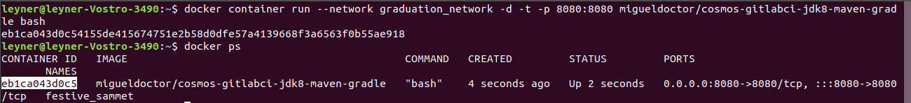
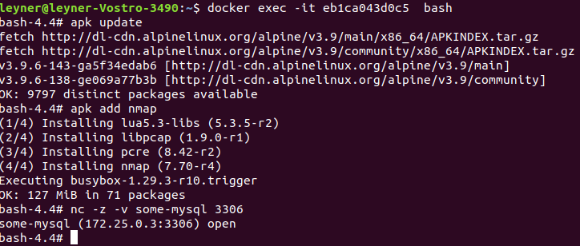
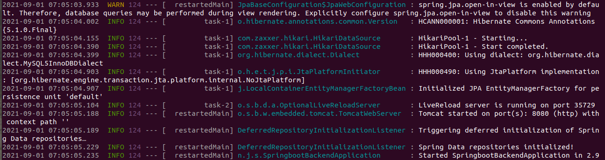
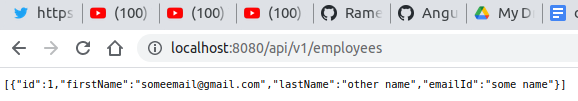
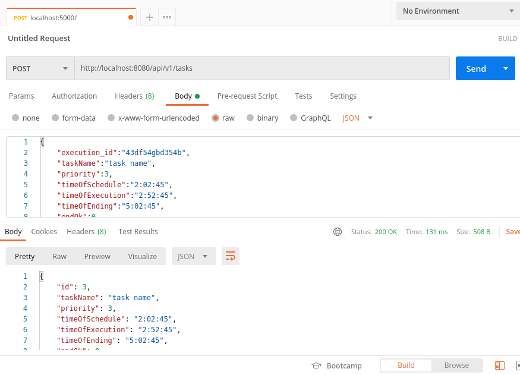

# java_springboot_docker_backend
Project created as a backend adding docker to the java guide project to make it more portable, the java guide project is [this](https://www.youtube.com/watch?v=G46fjVzQ7BQ&amp;t=828s).

## how to make it run

1. Install [Docker](https://docs.docker.com/engine/install/).

2. Get the docker image that we will use as a java remote server executing the command below

    1. execute the command "docker pull migueldoctor/cosmos-gitlabci-jdk8-maven-gradle"
    2. just for information, you can omit this, this is how the image was [created](https://migueldoctor.medium.com/how-to-create-a-custom-docker-image-with-jdk8-maven-and-gradle-ddc90f41cee4).

3. Get the docker image that we will use as database server
    1. execute this command "docker pull mysql"
    2. just for information, you can omit this, this is the docker hub page of the [image](https://hub.docker.com/_/mysql).
4. Create a docker network so the java remote server and the database server can talk to each other
    1. docker network create graduation_network
5. Run the mysql container

    1. docker run --network graduation_network --name some-mysql -p 3306:3306 -e MYSQL_ROOT_PASSWORD=my-secret-pw -d mysql
6. run the java remote server image
    1. --rm -v "$PWD":/app
    2. To know the container id execute the command "docker ps", the container id will be the one highlighted in the image, you know you are getting the right container id because of the container name in the same row
     
    3. docker exec -it  [CONTAINER_ID] bash
    4. inside of the container check connectivity from java server to database server
        
        1. apk update
        2. apk add nmap
        3. nc -z -v [host] [port]
        
        4. apk add --update mysql mysql-client
    5. Log into the mysql server
        1. mysql --user=root --password=my-secret-pw
        2. ALTER USER 'root' IDENTIFIED WITH mysql_native_password BY 'my-secret-pw';
    6. Log into the java server again to create the database and the table needed
        1. mysql --host=some-mysql --user=root --password=my-secret-pw
        2. create database employee_management_system;
        3. use employee_management_system;
        4. CREATE TABLE employees (
    id             INT,
    first_name      varchar(80),
    last_name       varchar(80),
    email_id        varchar(80)
);
        5. INSERT INTO employees (id, first_name,last_name, email_id)
VALUES (1, 'someemail@gmail.com', 'other name','some name');

    7. Copy the spingboot  code into the container (if you did not mount a volume)

        1.   docker cp spring-boot/.     [Container_ID]:/app/spring-boot/

        2. In the guide they use Eclipse as IDE, in this project we will try to only be using vscode as text editor, [guide](https://www.youtube.com/watch?v=G46fjVzQ7BQ&t=828s).
    8. Make the mvnw file executable
        1. chmod 777 mvnw
    9. Execute the java backend

        1. ./mvnw spring-boot:run
        2. if you see this error execute "unset MAVEN_CONFIG" and execute "./mvnw spring-boot:run" again"
        3. you will know that the system has already started when you see the message "Tomcat started on port(s): 8080" 

        4. check that the java system is capable of extracting the record we inserted into the database
        

## how we develop(ed) the system

1. [min 01:23:34](https://youtu.be/G46fjVzQ7BQ?t=5028) Now let's change the system to accommodate to your needs. all of the systems can be found in the git commit __________________

    1. Even though for the priorizerBL the important part is the data stored in memory/RAM (the data structures) but for analitycs is important to persist some information, so let's add the database task_logs_system where we will have metadata about the task (like how long did it took from the moment it was scheduled to the moment when it was executed, how many machines were there, how many times did the task had to retry).

2. get into the backend container, and connect to the database
    1.  docker container run --rm -v "$PWD":/app/ --network graduation_network -d -t -p 8080:8080 migueldoctor/cosmos-gitlabci-jdk8-maven-gradle bash
    2.  docker exec -it  [CONTAINER_ID] bash
    3.  nc -z -v [host] [port]
    4.  mysql --host=some-mysql --user=root --password=my-secret-pw
3. create the task_logs_system database 
    1.  create database task_logs_system;
    2.  use task_logs_system;
4. create the table
    1.  CREATE TABLE task (
    id                      INT NOT NULL AUTO_INCREMENT PRIMARY KEY,
    execution_id            varchar(80),
    task_name               varchar(80),
    priority                INT,
    time_of_schedule        varchar(80),
    time_of_execution       varchar(80),
    time_of_ending          varchar(80),
    end_ok                  INT,
    machine_log             text,
    num_retries             INT,
    machine_description     text,
    is_test                 INT
);
5. add some records for initial testing
    1. INSERT INTO task (execution_id, task_name, priority, time_of_schedule, time_of_execution, time_of_ending, end_ok, machine_log, num_retries, machine_description,is_test)
VALUES ('43df54gbd354b', 'task name', 1, '1:02:45', '2:02:45', '3:02:45', 0, 'Esto es un log', 4, 'numserver:4,server1:melo,server2:melisimo',1);

6. functional test for the post method
    1.  

7. doing the unittest
    1.  [guide 1](https://www.youtube.com/watch?v=--nQfs67zCM)
    2.  to know the last version of junit 5 this [link](https://maven.apache.org/surefire/maven-surefire-plugin/examples/junit-platform.html)
    3.  

#. In the video guide there is no Bussiness logic layer, some let's look for some example where I can see an example of this....... this one [looks](https://github.com/gothinkster/spring-boot-realworld-example-app/blob/master/src/main/java/io/spring/api/ArticleApi.java) promising
    1. 

